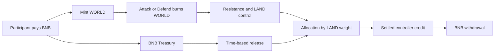

# WORLD
## An Autonomous On-Chain Territorial Economy

Whitepaper v1.0

This document describes the deployed BSC Mainnet Burn + Resistance V2 contracts. The whitepaper version is independent of the contract version.

## 1. Executive Summary

WORLD is an on-chain economy in which participants compete for control of 50 LANDs. WORLD is its transferable competition token. BNB paid to mint WORLD enters a Treasury, whose balance is released over time and allocated by fixed LAND weights. A LAND's controller accrues its allocated rewards while in control; settled credits remain withdrawable after control is lost.

Attacks and defenses burn WORLD immediately. They change a numerical defense called Resistance, rather than depositing tokens into a recoverable position. Resistance decays with a 45-day half-life; the Treasury releases BNB through a separate 60-day half-life process. Control does not expire automatically. It changes only through a qualifying attack.

The deployed contracts contain no administrator able to allocate LAND, change prices or weights, pause competition, upgrade the implementation, or withdraw Treasury funds outside the reward rules. Participants supply the transactions that advance stored state. No operator is required to approve their actions or calculate discretionary rewards.

Fixed rules do not imply fixed economic outcomes. Future funding, competition, holding periods, and participant costs depend on other people's decisions. WORLD offers no fixed-income entitlement, redemption right, or protection against loss.

## 2. Design Principles

**Execution follows contract state.** Purchases, burns, takeovers, reward credits, and withdrawals are enforced by the deployed contracts. A website description or transaction preview cannot override execution. The same call can have a different outcome if another transaction changes state before it is included.

**Rules do not distinguish founders from other participants.** The contracts assign no initial WORLD allocation or LAND control to the deployer. They expose no privileged participation route. Wallets and other contracts may participate subject to the same balances, approvals, epoch checks, and numerical limits. This does not imply equal capital, information, transaction ordering, or access to infrastructure.

**Economic claims come from LAND control.** Holding WORLD alone earns no Treasury distribution. Burning WORLD alone also earns none. Rewards follow the LAND accounting rules, including first-occupation treasure and settlement of a departing controller's entitlement.

**Authority is explicit and limited.** Token minting is restricted to an immutable Core, which exposes a paid purchase path. Profile editing is restricted to the current controller and epoch. Withdrawals spend the caller's own reward balance. These restrictions enforce the protocol; they are not discretionary administrative roles.

**Time is evaluated when needed.** Decay is derived from chain timestamps and stored anchors. A view call can compute current values without rewriting storage. Actual transfers and state changes require transactions and gas. Autonomy means the absence of an administrative operating requirement, not the absence of users, validators, wallets, or network infrastructure.

## 3. Economic System

The system connects two assets with different roles. BNB funds distributions. WORLD is minted against BNB and consumed in competition. LAND control determines who receives the distributions; it is not a token balance or a claim held by every WORLD owner.



A burn does not itself deposit BNB. A purchase funds the Treasury even if the purchaser never attacks. A token acquired through a transfer may later be burned without new BNB entering the Treasury at that time. These distinctions are necessary to understand the funding cycle.

### 3.1 WORLD Mint Economy

The Token begins with zero supply. Its name and symbol are WORLD, and it uses 18 decimals. One whole WORLD contains `10^18` indivisible token units, called atoms in this document. There is no initial team allocation, scheduled issuance, or supply target in the contracts.

Any participant can call Core's `buyWorld(q, recipient)`, where `q` is a positive number of atoms and `recipient` is a nonzero address. Core's immutable price is `10^12` wei per whole WORLD, equivalent to `0.000001 BNB`. The exact payment is:

```text
TOKEN_UNIT = 10^18 atoms per WORLD
WORLD_PRICE = 10^12 wei per WORLD

quoteBuy(q) = ceil(q * WORLD_PRICE / TOKEN_UNIT) wei
```

Core requires `msg.value` to equal this quote. Both underpayment and overpayment revert. Every purchased atom is newly minted to the recipient; no existing inventory is sold first. The entire payment is recognized as Treasury income. Gas is separate and does not enter the WORLD Treasury.

For example, buying 1,000 WORLD means submitting `q = 10^21` atoms. The required payment is `10^15` wei, or `0.001 BNB`, before gas. For fractional purchases, the ceiling to a whole wei matters. A linear price calculation without that rounding is not always the executable quote.

Only the bound Core can mint. Core does not expose a free mint method, and the factory receives no continuing issuance authority. Supply rises through purchases and falls through burns. There is no preset economic supply cap, but checked integer and Treasury bounds constrain accepted operations.

WORLD ownership is not Treasury ownership. The Token provides no redemption function that exchanges WORLD back into Treasury BNB, and no share of Treasury income simply for holding or transferring tokens. Any external market price or liquidity is outside the primary purchase mechanism. The fixed primary quote is neither a resale commitment nor a price floor.

### 3.2 WORLD Burn Economy

Every successful Attack or Defend burns the caller's full submitted amount. This includes an attack that reduces Resistance without taking control. A reverted transaction does not retain the burn: token balances, allowance changes, reward credits, and contract state roll back together.

Before a war action, the holder authorizes Core through the Token's allowance mechanism. Core can call `burnFrom`, but the action spends the initiating caller's WORLD, subject to balance and allowance. An approval is not itself a burn or a deposit.

Burned WORLD is removed from supply. It does not become a Reserve, a locked defense balance, or a recoverable stake. The Resistance created by a burn is a number in Core storage. Neither the defending controller nor a later conqueror can redeem that number for tokens. A holder can also call Token's direct `burn` function, but that voluntary burn creates no Resistance, LAND control, or reward entitlement.

Minting and burning therefore connect funding to competition without making each action a matched exchange. Minting creates spendable WORLD and adds BNB to the Treasury. Burning consumes WORLD and changes a competitive position. Further purchases are possible, but burns do not force anyone to buy replacements.

Supply reduction alone establishes no future market value. Demand can fall, external liquidity can disappear, and newly minted supply can exceed burns. The economic role of burning is irreversible expenditure on competition, not a contractual mechanism for increasing the token's price.

### 3.3 BNB Treasury

Treasury income comes from primary WORLD purchases and recognized BNB donations or other native-currency surplus. Core can receive BNB directly, but a bare transfer is not immediately added to the release calculation. A later purchase or a permissionless `syncSurplus()` call recognizes the excess balance. Synchronization provides no bounty and no special claim for the caller.

Core distinguishes its physical BNB balance from its internal liabilities. `accountedBNB` includes recognized income that has not been withdrawn. Part is still unreleased; part may already belong to unsettled LAND allocations or settled controller credits. Treating the whole contract balance as fresh distributable Treasury would count liabilities twice. Unrecognized surplus is separate again.

For an interval with no new income, the continuous reference model for unreleased Treasury is:

$$
u(t)=u_0\,2^{-\Delta t/T},\qquad T=60\text{ days}.
$$

The reference amount released over that interval is `u0 - u(t)`. This is a half-life, not a deadline: the contract does not empty the Treasury after 60 days. The actual Solidity implementation uses deterministic integer arithmetic with upward rounding of the remaining amount, as described in Section 3.5.

Internally, Core uses a scale `B = 2^96`. Let `U` be unreleased Treasury in units of `1/B` wei and `J` the cumulative release index in the same units. From the last stored Treasury anchor:

```text
U = TreasuryDecayBSC.remainingUpper(U0, elapsedSeconds)
J = J0 + U0 - U
```

Recognizing `v` wei of new income first evaluates this existing state, then stores:

```text
U0 = U + v * B
J0 = J
t0 = current block timestamp
```

Previously released amounts are not put back into Treasury. New income joins the amount still unreleased and starts decaying from the new anchor. Integer rounding is part of this transition.

For LAND `i`, let `w_i` be its weight and `j_i` its last settlement index. Its unsettled entitlement is the exact rational amount:

$$
E_i=\frac{w_i(J-j_i)}{65B}\text{ wei}.
$$

Settlement adds the integer numerator `w_i * (J - j_i)` to the beneficiary's aggregate `claimable` balance and advances the LAND's `j_i` to `J`. The `Earned` event records this credit. It does not send BNB. A controlled LAND can be settled by anyone, but the credit goes to its controller, not the transaction sender.

A beneficiary withdraws an affordable positive whole-wei amount from its own settled balance using `withdrawRewards`. The function debits `amountWei * 65 * B`, transfers BNB to the chosen nonzero recipient, and reduces `accountedBNB`. Fractional credit remains. Withdrawal does not first settle pending LAND income; those are separate operations.

The accounting conserves recognized BNB. With `A = accountedBNB` and `C_a` the stored claim numerator of each beneficiary:

$$
65BA=65U+\sum_{i=1}^{50}w_i(J-j_i)+\sum_a C_a.
$$

This separates unreleased funds, unsettled allocations, and settled credits without rounding away fractional liabilities. Neutral LAND allocations are included. Unrecognized surplus is outside this identity until synchronized.

The Treasury is not a staking pool: there is no recoverable WORLD principal deposited to earn rewards, no holder-proportional allocation, and no external yield strategy in Core. BNB is redistributed from recognized funding under fixed time and LAND-weight rules. No project operator chooses individual reward amounts.

### 3.4 LAND as Economic Claims

LAND is a Core state record, not an ERC-721 token. Its principal economic role is temporary competitive access to a share of Treasury releases. Control has no fixed term but can be displaced by a qualifying attack.

| LAND group | IDs | Count | Weight each | Combined weight |
| --- | --- | ---: | ---: | ---: |
| Crown | 1 | 1 | 6 | 6 |
| Highlands | 2–6 | 5 | 3 | 15 |
| Other LANDs | 7–50 | 44 | 1 | 44 |
| Total | 1–50 | 50 | — | 65 |

For the same release-index increment, the Crown receives six times the allocation of a weight-one LAND, and each Highland receives three times that allocation. Weights do not depend on Resistance, token balance, the controller's identity, or how many LANDs are occupied.

The denominator remains 65 when some LANDs are unclaimed. Their portions accumulate as treasure instead of being redistributed among occupied LANDs. First occupation settles that accumulated allocation to the incoming controller. On a later takeover, Core settles the departing controller before changing control, so a conqueror does not seize the previous controller's earned credit.

Core provides no direct LAND transfer, sale, lease, or approval function. An address becomes controller through a qualifying attack, not through assignment by the project or an NFT transfer. This is a statement about the Core interface, not a claim that all external arrangements are impossible: control of a wallet or of a contract that holds LAND can change outside WORLD, without changing the controller address recorded in Core.

LAND control and accrued BNB rights are separate. Losing control ends access to subsequent releases, but does not erase settled rewards. Spending more WORLD on defense changes Resistance; it does not increase LAND weight or buy an additional share of Treasury.

### 3.5 Dual Half-Life Economy

Resistance and Treasury follow separate clocks. Resistance uses a 45-day half-life from the most recent successful Attack or Defend on that LAND. Treasury uses a 60-day half-life from its stored income anchor. Reads, reward settlement, withdrawals, and Profile changes do not restart Resistance decay.

For an unchanged wall, its continuous reference curve is:

$$
r(t)=r_0\,2^{-\Delta t/H},\qquad H=45\text{ days}.
$$

These equations describe the economic curves. Exact execution uses the two dedicated decay libraries, fixed constants, chain timestamps, and integer rounding. Resistance is stored in Q64 atoms: a raw unit is `1 / 2^64` of a WORLD atom. Treasury uses `1 / 2^96` wei. Neither calculation uses JavaScript floating point.

At whole half-life intervals the libraries divide by the corresponding power of two and round the remaining amount upward. Fractional intervals use their certified fixed-point factors. Positive residual values can remain at one raw unit; elapsed time alone does not make a positive wall or Treasury remainder exactly zero. Resistance can nevertheless be reduced to zero by an equal-sized attack, without transferring control.

Every successful war first decays the old wall, then applies its own burn and records a new time anchor. Thus old Resistance is not refreshed without first accounting for elapsed decay. The new burn changes the effective wall immediately. Non-war actions cannot extend its life.

The unequal half-lives create a specific mechanical relationship. With no further war action or Treasury income, the wall's remaining fraction falls faster than the Treasury's remaining fraction. In the continuous reference model:

$$
\frac{r(t)/r_0}{u(t)/u_0}=2^{-\Delta t/(180\text{ days})}.
$$

After 180 days under those assumptions, Resistance retains one sixteenth of its starting amount and Treasury retains one eighth, before implementation rounding. This can reduce a later challenger's barrier relative to the remaining pool. It does not determine the value of attacking: funding, reinforcement, other attackers, prior releases, gas, and token acquisition costs can all change the comparison.

A controller can hold a LAND without continually submitting transactions if nobody takes it. There is no automatic eviction when its wall becomes small. Conversely, a large original burn confers no permanent protection, because the remaining barrier decays and may be attacked. Time changes competitive conditions; it does not select a winner.

### 3.6 Economic Feedback Loop

New purchases simultaneously create WORLD supply and recognized Treasury income. A larger unreleased balance changes the amount available for future allocation. Participants may respond by acquiring LAND, reinforcing it, attacking elsewhere, or declining to participate. Their burns then change both supply and the distribution of competitive barriers.

This feedback is conditional. More participants need not mean more primary purchases: they may trade existing WORLD or simply transfer it. More Treasury funding need not produce proportionally more competition. Existing controllers can receive additional allocations without making a new expenditure if they remain in control. A supporter can burn WORLD on someone else's defense without receiving a protocol reward share.

The reverse process is equally possible. Purchases may slow while Treasury release continues. Remaining funding and the incentive to compete may decline. Lower Resistance can make entry cheaper while smaller future allocations make entry less attractive. Neither effect necessarily dominates. The world can remain quiet with the same controllers for a long interval.

There is no rule requiring fresh funding, participation, reinvestment of withdrawals, or continued activity. The protocol redistributes BNB that it has recognized; it does not create an external source of BNB revenue. Continued operation of the contracts is different from continued economic demand.

### 3.7 Calculable but Unpredictable

At a specified block, a participant can read each LAND's controller, epoch, weight, stored wall, and effective Resistance. Treasury state and settled credits are also observable. A primary purchase quote and the atom amount strictly above the current wall can be calculated exactly:

```text
minimumAttackAtoms = floor(currentResistanceRaw / 2^64) + 1
```

This minimum is conditional on the execution state and the contract's input limits. It does not include approval or transaction gas, an external market acquisition cost, or later defenses. A primary quote is known; the historical price paid by a particular wallet is not established by a burn event.

The `expectedEpoch` argument rejects a transaction after a takeover changes the epoch. It does not lock Resistance within the same epoch. Another defense or partial attack can change the wall, and time can change its effective value before inclusion. Transaction ordering therefore matters even when every participant can inspect the same rules.

Participants cannot infer future attacks, support, Treasury deposits, or their own eventual holding duration from current state. Calculating a conditional outcome is not forecasting that those conditions will persist. The economy is deterministic with respect to inputs and ordering, but those inputs are chosen by independent actors.

## 4. Protocol Immutability and Trust Model

The four deployed contracts are direct implementations with permanently bound counterparts. They do not route execution through an upgradeable proxy. Their public interfaces and inherited execution paths grant no owner, administrator, governance key, or project account discretionary control over the protocol.

| Authority | Deployed contract behavior |
| --- | --- |
| Owner or administrator | No protocol ownership role, administrative account, or role-management interface. |
| Upgrade or proxy replacement | No upgrade function, implementation setter, or delegatecall-based proxy dispatch. |
| Governance key | No voting or privileged execution path for changing these contracts. |
| Pause authority | No persistent pause flag or actor able to stop otherwise valid operations. |
| Parameter adjustment | Price, weights, half-lives, and arithmetic scales are constants or fixed code, without setters. |
| LAND assignment | Controller changes occur in the Attack state transition; no administrative reassignment function exists. |
| Privileged Treasury withdrawal | Withdrawals debit the caller's own settled claim balance. No team withdrawal or sweep exists. |
| Project-team minting | Token accepts mint calls only from its immutable Core; Core mints through its fully paid purchase path. |
| Counterparty replacement | Token, Core, and Profile bindings are immutable; Deployment only exposes their address getters after construction. |

This is stronger and narrower than a promise not to use administrative powers: the contracts do not grant those powers in the first place. The statement applies to the identified deployments and their verified code, not to every service using the WORLD name or to the BSC network itself.

There are still operational permissions. Token holders authorize spenders through ERC-20 allowances. Only Core may invoke Token's war-burn entry point, and that call checks allowance. Only the current controller can edit its LAND Profile. Only a beneficiary can spend its aggregate claim credit. These are local rights constrained by fixed code; none lets its holder rewrite another participant's rules.

Core's reentrancy guard is an execution safeguard, not a pause administrator. Its lock is entered and released as part of protected calls. The Token uses the inherited ERC-20 transfer implementation without a project tax, blacklist, or privileged balance-editing function. There is also no asset-recovery administrator: WORLD mistakenly sent to Core is not inventory and has no recovery entry point.

Immutability does not remove trust in every dependency. Users still depend on the execution chain, correct contract identification, cryptographic and software assumptions, and their chosen wallet and interfaces. Source inspection establishes the specified authority model; it does not prove the absence of every possible implementation defect.

### 4.1 Economic Importance of Immutability

Parameters are part of the economic position being acquired. A participant burns WORLD against a wall whose future decay is defined by code. The resulting LAND carries a fixed weight, while Treasury releases follow a fixed schedule. If an administrator could change these after the burn, the position would depend on that administrator's future decisions as well as on competition.

Changing the mint price could alter the cost of new competitive resources. Changing a half-life could alter the duration of a defense or the timing of distributions. Changing weights could redirect relative allocations. A privileged withdrawal could remove the funding against which participants had evaluated their positions. An attack-rule change could change what constitutes control.

The deployed WORLD contracts provide no such adjustment paths. The creator cannot unilaterally revise these terms while retaining the same contract instances. This narrows the uncertainty participants face to the fixed implementation, chain conditions, and the actions allowed by it. It does not eliminate uncertainty about profitability or future participation.

The distinction also makes verification meaningful over time. A reader can inspect the code and bindings of a specific instance rather than relying on a future governance decision to preserve them. A new website or a new software release cannot alter those on-chain bindings.

### 4.2 Cost of Immutability

Unsuitable parameters remain unsuitable. The creator cannot lengthen a half-life, change a price, reduce a weight, or introduce a recovery rule because later experience suggests a different design. There is no emergency pause to stop competition during an incident.

A defect cannot be repaired by upgrading the original contracts. A different protocol version would require new contracts and separate addresses. WORLD contains no migration administrator able to move everyone's tokens, claims, or LAND state to such a version. Participation in another deployment would not itself change the original deployment.

User mistakes likewise have no discretionary reversal path. Burns cannot be refunded, completed takeovers cannot be administratively undone, and funds sent to an unsupported address may be inaccessible. A party operating a contract controller must ensure that its own contract can invoke the required functions and receive or redirect rewards.

The original code and state remain on-chain under the chain's continued operation; a successor website or contract does not remove them. Continued reachability still depends on the underlying network. Immutability exchanges administrative flexibility for stable rules, including stable defects and limitations if any exist.

## 5. LAND Competition

A LAND starts without a controller, with zero Resistance and epoch zero. Epoch identifies a particular reign. A successful takeover increments it, including a takeover by the same controller. It does not advance through time alone.

At execution, Core first computes the decayed wall `r` in raw Resistance units. For a submitted burn of `x` atoms, define `s = x * 2^64`. The main transitions are:

| Action | Condition | Result after full burn |
| --- | --- | --- |
| Partial or equal Attack | `s <= r` | Resistance becomes `r - s`; controller and epoch remain unchanged. |
| Takeover | `s > r` | Resistance becomes `s - r`; attacker becomes controller; epoch increments. |
| Defend | LAND is controlled and the resulting wall is within bounds | Resistance becomes `r + s`; controller and epoch remain unchanged. |

Every war requires a positive input below the maximum war amount and a matching `expectedEpoch`. Equality is not a takeover. A successful Attack receipt may therefore represent expenditure without control. Only a strict crossing creates a new reign. The entire takeover input burns, including its excess; the excess wall is not an unspent token balance.

An unoccupied LAND has no defending controller and cannot receive Defend. Its first qualifying attack creates epoch one and credits accumulated treasure to the incoming controller. For later takeovers, Core credits the old controller's unsettled allocation at the current release index before assigning the new controller. The `Earned` event precedes `Taken` in that transition.

A controller may attack its own LAND. A non-crossing self-attack burns WORLD while reducing its wall. A crossing self-attack closes the old reign and opens a new epoch at the same address. The reward settlement and Profile invalidation rules still apply.

Any holder can defend an occupied LAND, including one controlled by another address. Third-party defense grants no control, reward share, repayment right, or Profile permission. Agreements outside WORLD are not enforced by this function.

Reward collection is a separate state transition. `settleLand` credits the controller's aggregate balance, and `withdrawRewards` transfers an affordable whole-wei amount. The DApp's Claim label refers to settlement; there is no separate `claim()` contract method. Neither operation strengthens the wall, changes the controller, nor restarts Resistance decay.

## 6. Strategic Dynamics

A low wall reduces the amount currently required to cross it, but says little about how long the new controller will remain. The takeover excess becomes the new wall. A burn barely above the old wall can leave a small initial barrier, while a larger burn establishes a larger barrier at an irreversible cost. The contracts prescribe neither an optimal margin nor an intended holding period.

A higher LAND weight increases allocation for a given release increment. It can also attract more competition. The Crown's larger share is a property of its weight, not evidence that it offers a better outcome after burns and gas. Lower-weight LANDs may face different competition, but the protocol supplies no measurement of future attacker demand.

Reinforcement trades additional WORLD destruction for a larger current wall. It does not increase the release share, refund earlier expenditure, or reverse elapsed decay. Support from other holders can change the position without changing the controller's own burn total. Participants evaluating performance must distinguish those sources of expenditure.

Holding longer gives access to subsequent releases while control persists. It also exposes the controller to future attacks. Existing settled credits survive a takeover, so the risk concerns remaining competitive expenditure and foregone future allocations rather than confiscation of those credits by the conqueror.

Competition can be cumulative. A partial attack can weaken a wall that a different participant later crosses. The earlier attacker receives no automatic credit for making that takeover easier. Concurrent attacks and reinforcements can change execution outcomes within the same epoch. Multiple wallets or contract controllers may coordinate, but Core treats their calls according to state and order, not alliance membership.

Capital may be concentrated in one LAND or spread across several. Multiple LANDs provide several weighted allocations and several defenses to maintain. Claim credits aggregate by beneficiary, but each LAND retains its own wall, epoch, and settlement index. These choices concern exposure to competition and funding; the fixed rules do not establish a universally profitable allocation.

## 7. Smart Contract Architecture

The protocol consists of four deployed contracts and internal mathematical libraries. Their responsibilities are separated, while their counterpart addresses are fixed at construction.

```text
WorldDeploymentBSCV2
  CREATE 1: WorldTokenBSCV2       -- immutable core --> WorldCoreBSCV2
  CREATE 2: WorldCoreBSCV2        -- immutable token --> WorldTokenBSCV2
  CREATE 3: WorldLandProfileBSCV2 -- immutable core --> WorldCoreBSCV2
```

**WorldDeploymentBSCV2** constructs a new Token, Core, and Profile in one transaction. It predicts the address of its second CREATE so that the Token can be bound to the future Core before Core exists. It then checks the resulting address, reciprocal Token/Core bindings, initial supply, decimals, and principal economic constants. Profile is created afterward and its Core binding is checked. Failure reverts the entire deployment. The constructor takes no external arguments.

The factory's value is this atomic construction and verification of a fresh set of counterparts. After construction it exposes only the three immutable address getters. It is not a manager with permission to create replacements for this world or redirect its participants.

**WorldTokenBSCV2** provides ERC-20 balances, transfers, and allowances. Its additional functions support Core-only minting, Core-only allowance-checked war burns, and voluntary holder burns. No Token function assigns LAND or credits BNB rewards.

**WorldCoreBSCV2** implements purchases, the LAND state machine, both decay calculations, Treasury income recognition, reward settlement, and withdrawal. Treasury and Resistance use independent libraries and scales. Core does not consult an external price oracle or a discretionary reward server to execute these rules.

**WorldLandProfileBSCV2** provides optional LAND display metadata bound to the current controller and epoch. Only the current controller may update it. Profile metadata does not affect LAND weight, Resistance, Treasury allocation, control, or rewards.

## 8. On-Chain Verification

WORLD is deployed on BSC Mainnet, Chain ID **56**, at deployment block **125288896**. The deployment transaction is [0xbecbfdda60a28d6c365ac2fc07728bc99fcbeb6db989337f7528d8db2c640721](https://bscscan.com/tx/0xbecbfdda60a28d6c365ac2fc07728bc99fcbeb6db989337f7528d8db2c640721).

The four contract addresses and their BscScan code pages are listed in Appendix B. All four are recorded in the current release documentation as **Source Code Verified / Exact Match**. The official interface is [burntheworld.xyz](https://burntheworld.xyz); the public source repository is [burn-the-world/world-public](https://github.com/burn-the-world/world-public).

Exact Match establishes a correspondence between published source, compiler configuration, and deployed code. It is not a security audit, a proof of economic sustainability, or an assurance that no defects exist. Readers must also identify the correct chain and contract instances; matching names alone are insufficient.

Independent checks can read the factory's `token()`, `core()`, and `profile()` getters, then confirm `Token.core()`, `Core.token()`, and `Profile.core()`. The `WorldDeployed` event records the same three addresses. Public constants and `weightOf` expose the principal economic configuration.

The repository's canonical Prague release check reproduces the complete factory creation bytecode, including metadata. Constructor-installed immutable addresses must be accounted for when comparing runtime code to compiler templates. Recompiling with different source identifiers or settings can change metadata even when a source-level description appears unchanged. Appendix C identifies the release configuration and reference artifact.

## 9. Frontend and Protocol Independence

The official website is one client of the contracts. Its interface, translations, caches, and availability can change independently of on-chain rules. Its launch flags are application controls, not an administrative pause inside Core.

The DApp uses a Worker for shared reads and cached aggregates, with wallet-provider reads where appropriate. Wallets sign and submit transactions. The official read proxy does not hold user signing authority. Neither the proxy nor a browser cache decides the state transition executed by a mined transaction.

If the website, Cloudflare service, or official RPC becomes unavailable, the deployed contracts are not thereby removed. Subject to BSC availability and access to another suitable provider, third parties can read state, submit permitted calls, build clients and APIs, and independently index events. Complete historical reconstruction also requires adequate log and historical-state coverage.

Leaderboards are off-chain, non-authoritative presentations of on-chain data. They do not alter any on-chain entitlement. Third parties can use the same data to construct different rankings without changing the protocol. The official interface's calculation methodology is documented separately in [REIGN_PERFORMANCE.md](../app/public-mainnet/docs/REIGN_PERFORMANCE.md).

## 10. Risks and Limitations

**Smart contract risk.** Bugs in application code, dependencies, arithmetic, or their interaction can cause loss or prevent intended operations. Reproducible bytecode and passing tests are evidence about specific properties, not proof that every behavior is safe. The BSC execution environment is an additional dependency.

**Irreversibility risk.** There is no upgrade administrator, pause authority, or recovery account. An implementation defect or an unsuitable parameter cannot be corrected in place. A user cannot request reversal of a valid burn or takeover. A replacement deployment would be a different set of contracts, not a repair to the original instances.

**Economic model risk.** Fixed allocation and decay equations do not determine future funding or behavior. Competition can consume more WORLD than participants later receive in BNB value. An economically weak state can persist without a party able to change the rules. Historical performance does not establish future outcomes.

**WORLD price and liquidity risk.** The primary purchase price supplies no buyback right. WORLD may have little or no external liquidity, and a market price can differ from the protocol quote. Token transfers and prior purchases also mean a displayed reference cost may differ substantially from the participant's actual cost. There is no contractual resale outlet.

**LAND takeover risk.** Control can be lost after expenditure. Partial attacks burn without taking control, and a successful takeover can be followed immediately by another. Greater Resistance changes the current threshold but provides no protected holding period. Third-party reinforcement does not give its supporter a claim against the controller.

**Treasury and low-activity risk.** Without new recognized income, unreleased Treasury approaches a very small balance. Upward rounding can retain a positive sub-wei residual while economically meaningful future distributions are negligible. Quiet periods do not stop decay, and continued control does not guarantee material BNB receipts. The physical contract balance may include liabilities already owed, not a fresh reward pool.

**Execution and gas risk.** Approvals, war actions, settlement, and withdrawals require gas. Reverted transactions can still incur network costs. Congestion, ordering, and same-epoch changes can invalidate a preview or alter an attack's result. The strict epoch check protects against a different reign, not all intervening state changes.

**Wallet and controller risk.** Compromised keys, unsuitable allowances, wrong contract selection, or incorrect network selection can cause loss. A contract controller has the rights of its address, but its human operator does not automatically have a direct-call substitute. The controller's own implementation must support the required interactions. A recipient that rejects BNB causes withdrawal to revert; Core does not appoint someone else to collect the balance.

**RPC and frontend risk.** Stale, incomplete, or manipulated responses can misrepresent walls, quotes, balances, or rankings. A compromised frontend can request an unintended transaction even though it cannot rewrite Core. Participants remain responsible for what their wallet signs. Caches and indexers add availability and freshness limits.

**Integration and metadata risk.** External controllers, markets, explorers, and interfaces have their own assumptions and failure modes. WORLD does not enforce an external alliance agreement or repayment arrangement. Profile content is user-controlled display data. A recognizable LAND name does not authenticate a counterparty.

**Numerical limits.** Input bounds, checked arithmetic, and whole-wei withdrawals are part of the implementation. Very small credits can remain below the transferable unit. A calculated crossing amount can exceed the legal single-war domain. Integrations must preserve integer precision and respect these limits rather than silently rounding a transaction amount.

Participants can lose the full value of their expenditure, including purchased or burned WORLD and gas. LAND competition is not a fixed-income product. The contracts promise no minimum distribution, profitable holding period, or compensation for loss.

## 11. Conclusion

WORLD combines a BNB-funded Treasury, paid WORLD issuance, irreversible competition burns, weighted LAND control, and two independent time-decay processes. Settlement preserves the rights already credited to controllers; competition determines access to subsequent releases.

No administrator can redirect those rules within the deployed instances. That removes discretionary parameter control while also removing an in-place correction mechanism. The economy's behavior remains contingent on funding, transaction order, and participant decisions.

The rules are fixed. The outcomes are not.

## Appendix A — Mainnet Parameters

The table below is extracted from the current Core, Token, Profile, and decay-library source. Derived values use exact integer arithmetic. Bounds describe accepted arithmetic domains, not economic supply targets. BNB uses `10^18` wei per BNB.

| Parameter | Source identifier | Value or rule |
| --- | --- | --- |
| LAND count | `N` | 50 |
| Total LAND weight | `W` | 65 |
| Crown weight | `weightOf(1)` | 6 |
| Highland weight | `weightOf(2..6)` | 3 |
| Other LAND weight | `weightOf(7..50)` | 1 |
| Initial WORLD supply | `Token constructor; factory assertion` | 0 |
| WORLD decimals | `Inherited ERC20.decimals()` | 18 |
| WORLD atom scale | `TOKEN_UNIT` | `10^18` atoms per WORLD |
| Primary price | `WORLD_PRICE` | `10^12` wei per WORLD = `0.000001 BNB` per WORLD |
| Purchase payment | `quoteBuy(q)` | `ceil(q * WORLD_PRICE / TOKEN_UNIT)` wei; exact payment required |
| Treasury half-life | `T; TreasuryDecayBSC.T` | 60 days = 5,184,000 seconds |
| Resistance half-life | `RESISTANCE_HALF_LIFE; ResistanceDecayBSC.H` | 45 days = 3,888,000 seconds |
| Treasury scale | `B` | `2^96` raw units per wei |
| Reward denominator | `W * B` | `65 * 2^96` numerator units per wei |
| Resistance scale | `_warRaw(amount)` | `2^64` raw units per WORLD atom |
| War input | `MAX_WAR_ATOMS` | `0 < amount < 2^128` WORLD atoms |
| Stored Resistance bound | `RESISTANCE_LIMIT` | `0 <= resistanceRaw < 2^192` |
| Recognized BNB balance bound | `_addIncome` | `accountedBNB <= 2^128 - 1` wei |
| Unreleased Treasury bound | `_addIncome; TreasuryDecayBSC.MAX_U` | `0 <= U < 2^224` raw Treasury units |
| Chain time accepted by Core | `_time()` | `0 <= block.timestamp <= 2^64 - 1` seconds |
| Epoch bound | `attack()` | A takeover requires the prior epoch to be below `2^256 - 1` |
| Minimum positive war input | `_warRaw(amount)` | 1 atom; takeover additionally requires strict wall crossing |
| Withdrawal unit | `withdrawRewards` | 1 wei; fractional claim numerators are retained |

Profile limits are display constraints, not economic weights or reward parameters:

| Field | Source identifier | Maximum UTF-8 bytes |
| --- | --- | ---: |
| Name | `MAX_NAME_BYTES` | 64 |
| Logo URI | `MAX_LOGO_URI_BYTES` | 256 |
| Website | `MAX_WEBSITE_BYTES` | 256 |

Parameter sources: [Core](../contracts/src/WorldCoreBSCV2.sol), [Token](../contracts/src/WorldTokenBSCV2.sol), [Profile](../contracts/src/WorldLandProfileBSCV2.sol), [inherited ERC-20 implementation](../contracts/lib/openzeppelin-contracts/contracts/token/ERC20/ERC20.sol), [Treasury decay](../contracts/src/libraries/TreasuryDecayBSC.sol), and [Resistance decay](../contracts/src/libraries/ResistanceDecayBSC.sol). The factor tables and their mathematical evidence are included with the [contract sources](../contracts/src/libraries/), [Treasury certificate](../contracts/artifacts/math-treasury-decay-certificate-bsc.json), and [Resistance certificate](../contracts/evidence/resistance-math-certificate.json).

## Appendix B — Contract Addresses

These identifiers are taken from the release's [Mainnet manifest](../app/config/networks/mainnet.json). They identify one deployment; names or token symbols alone do not.

- Network: BSC Mainnet.
- Chain ID: **56**.
- Native asset: **BNB**.
- Deployment block: **125288896**.

| Contract | Mainnet address / verified source |
| --- | --- |
| WorldDeploymentBSCV2 | [0x2F8e4b4De457aC01992e4628794DBd681f09Be30](https://bscscan.com/address/0x2F8e4b4De457aC01992e4628794DBd681f09Be30#code) |
| WorldTokenBSCV2 | [0xB1D67858e8374636Ca4379d2842FB166A2197A55](https://bscscan.com/address/0xB1D67858e8374636Ca4379d2842FB166A2197A55#code) |
| WorldCoreBSCV2 | [0x755bae50BcAc16F3b11fc84BCfCFE0a192c009e7](https://bscscan.com/address/0x755bae50BcAc16F3b11fc84BCfCFE0a192c009e7#code) |
| WorldLandProfileBSCV2 | [0x33b2FE6F3EBF80eBBE74e8c388C0FEB1717EE2e0](https://bscscan.com/address/0x33b2FE6F3EBF80eBBE74e8c388C0FEB1717EE2e0#code) |

## Appendix C — Verification

| Release property | Value |
| --- | --- |
| Solidity compiler | `0.8.30+commit.73712a01` |
| Optimizer | Enabled; 200 runs |
| EVM target | Prague |
| viaIR | `false` |
| Metadata bytecode hash | IPFS |
| Canonical source units | 18; exact source bytes and verified source identifiers |
| Factory | `WorldDeploymentBSCV2` |
| Factory constructor arguments | None |
| Factory deployment value | 0 BNB |
| External library linking | None |
| Mainnet deployment block | 125288896 |
| Explorer verification | All four contracts: Verified / Exact Match |
| Factory creation bytecode | 18,749 bytes |
| Factory creation SHA256 | `0a9f615a012e810d49123b7d27ab3cd5c25087e0a9e62306f29552486eb5ddeb` |

The canonical release check uses `src/...` and `@openzeppelin/contracts/...` source identifiers with no Standard JSON remappings. Foundry retains its repository remappings. These are different ways to locate the same pinned source bytes; source identifiers must also match to reproduce the full metadata-bearing artifact.

The exact creation-bytecode reference is the retained [Testnet deployment input](../contracts/release/testnet-deployment-input.hex). It comes from transaction `0xd3e609f84f6dfbc9222b2557d17e383eb5a5223531620b2f6f394b80913ac2c5` at BSC Testnet block **133830577**, Chain ID **97**. This is a reproducibility reference, not the Mainnet address configuration. The Mainnet deployment transaction and addresses are identified separately in Section 8 and Appendix B.

From the repository root, the following checks are local and do not submit a transaction:

```sh
node scripts/verify-release.mjs
node scripts/verify-integrity.mjs
```

The first compiles Prague, verifies source content, compares the four ABIs and function selectors, and requires a byte-for-byte match of the complete factory creation code to the retained reference. The second checks pinned inputs, contract fixtures, and ABI copies.

The [deployment reference](deployment.md), [rules](../app/public-mainnet/docs/V2_UI_RULES.md), [integration reference](../app/public-mainnet/docs/V2_CONTRACT_INTEGRATION.md), and [leaderboard accounting](../app/public-mainnet/docs/REIGN_PERFORMANCE.md) provide the supporting implementation detail. Reproduction, source verification, and accounting tests have different scopes; none should be presented as an independent security audit.
